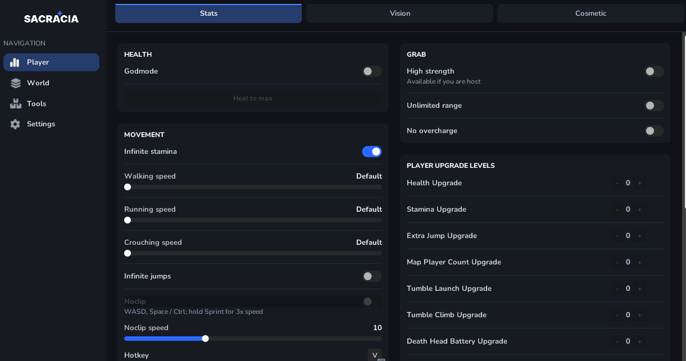

# RepoHax



RepoHax is an internal C++ mod and developer toolbox for **R.E.P.O.** It uses a custom immediate-mode UI, a native Unity SDK, and DLL proxy loading without requiring an external injector.

> [!IMPORTANT]
> This project was created for educational and mod-development research. Use it only in environments where every affected player has agreed to the changes. Host-only controls are marked in the menu and automatically disabled for clients.

## Official sources

> [!CAUTION]
> Only download builds from trusted project pages:
> [This repository](https://github.com/ReNothingg/RepoHax)
> [Upstream GitHub repository](https://github.com/Sacracia/RepoHax)
> [Nexus Mods](https://www.nexusmods.com/repo/mods/214)
> [Playground](https://users.playground.ru/3241576/posts)

## Interface

The redesigned menu is organized by purpose and uses one scrollbar for the entire active page:

- **Player** — Stats, Vision, Cosmetic
- **Session** — Session & Level, Entities & Team
- **Economy** — quota, balance, valuables, extraction, and loot
- **Tools** — Items & Spawn, Teleport, Object Editor
- **Settings** — language, menu hotkey, and interface preferences

English and Russian localization is available from the Settings page.

## Complete feature list

### Player — Stats

#### Health and movement

- Local god mode and heal-to-maximum
- Infinite stamina and infinite jumps
- Independent walk, sprint, and crouch speed multipliers
- Noclip flight with collision bypass and gravity suppression
- Configurable flight speed and sprint-key boost multiplier
- WASD movement with Space / Ctrl for vertical movement
- Configurable flight toggle and player-to-camera hotkeys
- Tumble prevention, including protection while flying

#### Deadly eye lasers

- Visible dual eye-laser effects based on the game's laser system
- Configurable range and damage
- Optional instant enemy kill
- Optional GameObject destruction for the host
- Configurable toggle hotkey

#### Grabbing

- High grab strength
- Unlimited grab range
- No overload / overcharge

#### Player upgrade levels

Increase or decrease every local upgrade independently using the original in-game names:

- Health Upgrade
- Stamina Upgrade
- Extra Jump Upgrade
- Map Player Count Upgrade
- Tumble Launch Upgrade
- Tumble Climb Upgrade
- Death Head Battery Upgrade
- Tumble Wings Upgrade
- Sprint Speed Upgrade
- Crouch Rest Upgrade
- Strength Upgrade
- Throw Strength Upgrade
- Range Upgrade

#### Powerups and health packs

- Automatically apply selected upgrades when they become available
- Per-upgrade automatic-use filters
- Manually apply available upgrade items
- Apply small, medium, and large health packs directly to the local player

### Player — Vision

- Enhanced vision
- Environmental fog override
- Occlusion-culling override with configurable render distance from 32 to 500 metres
- Third-person camera
- Configurable field of view from 60° to 140°
- Flashlight intensity and cone-angle controls
- Flashlight support while crouching / crawling
- Infinite Dead Head battery

### Player — Cosmetic

- Cosmetic-box ESP
- Unlock or reset all cosmetics
- Spawn Common, Uncommon, Rare, or Ultra Rare cosmetic rewards as host

### Session — Session & Level

#### Status and progression

- Current level, authority, completed-level count, module progress, active enemies, valuables, extraction points, save file, and last-action status
- Increase or decrease completed-level count
- Advance to the next level
- Filter maps out of the host's rotation

#### Session tools and safety

- Save the current run immediately
- Reload the current level
- Unlock extraction points
- Preserve the save after the entire team dies
- Automatically disable movement tools when the player or game state is not ready
- Automatically cancel queued host-only commands on clients
- Optionally block the all-players-dead game-over check
- One-click reset for risky toggles and queued actions

#### World controls

- Time scale from 0% to 300%
- Custom world gravity from -30 to 30
- Freeze / unfreeze world physics
- Blackout, full-bright, and restore-lighting actions

### Session — Entities & Team

#### Enemies

- Spawn any discovered enemy setup as host
- Remove the maximum enemy grab-time limit
- Enemy ESP
- Pacify or freeze all enemies
- Gather all enemies near the camera
- Kill or delete all enemies

#### Players and friends

- Player ESP and through-wall chams
- Select an individual player
- Tumble, kill, revive, or fully heal the selected player
- Protect selected friends from damage
- Protect selected friends from tumbling
- Switch the local voice-chat state between alive and dead channels

#### Team-wide actions

- God mode for everyone
- Tumble protection for everyone
- Heal, revive, or gather the whole team
- Apply a team-wide player scale

### Economy

#### Quota and balance

- Display and change the current extraction quota
- Apply a new quota to every extraction point
- Display the current run balance
- Add or subtract a configurable amount of money
- Set the balance to zero
- Repair an overflowed balance to a shop-safe value
- Host balance changes are synchronized and saved immediately

#### Valuables and extraction

- Valuable ESP with configurable display distance
- Valuable chams / x-ray highlighting
- Prevent valuable damage as host
- Set all valuable prices to zero or maximum
- Extraction-point ESP
- Activate the next extraction point

#### Loot control

- Freeze / unfreeze all valuables
- Bring all valuables to the player or truck
- Send all valuables to the extraction zone
- Smart extraction packing uses the real extraction-area collider, object sizes, centered rows, and multiple layers to keep loot inside the quota zone
- Discover all valuables
- Apply a configurable value multiplier to all loot

### Tools — Items & Spawn

- Infinite held-weapon battery
- Weapon laser sight / crosshair
- Spawn any available item as host
- Configurable item-spawn hotkey
- Raycast GameObject remover with configurable range
- Deletes complete ordinary GameObjects, not only interactable items
- Networked Photon objects are removed for all players when used by the host
- Configurable deletion hotkey and visible aimed-target status

### Tools — Teleport

- Teleport to the truck, extraction point, nearest valuable, or a panic-safe position
- Teleport to a selected player
- Bring a selected player to the host
- Move the local player to the camera position
- Truck ESP
- Runtime saved-position slots with Save, Go, and Clear actions

Saved-position slots are intentionally cleared when the game is restarted.

### Tools — Object Editor

#### Target inspector

- Raycast scene targeting and target locking
- Object name, position, layer, and network-authority information
- Configurable lock-target hotkey

#### Telekinesis and direct transforms

- Hold / release a selected object
- Configurable hold distance and throw force
- Pull, push, freeze, and locally duplicate objects
- Uniform scale and independent X / Y / Z scale controls
- Independent X / Y / Z rotation controls
- Apply transforms, delete targets, clear selection, and undo recent actions

#### Unity-style 3D gizmo

- Visible X, Y, and Z handles
- Move (`W`), rotate (`E`), and scale (`R`) modes
- World-space and local-space axes
- Drag handles with the left mouse button
- Entering scene-edit mode closes the menu; `Esc` exits edit mode and returns to the menu
- Networked position and rotation use the game's `PhysGrabObject` / Photon synchronization path

### Settings

- English and Russian interface language
- Configurable menu hotkey
- Optional background dimming
- Persistent configuration in `haxsdk.ini`

## Default hotkeys

| Action | Default key | Rebind location |
|---|---:|---|
| Open / close menu | `` ` `` / `~` | Settings |
| Spawn selected item | `F6` | Items & Spawn |
| Toggle noclip flight | `F7` | Stats |
| Toggle eye lasers | `F8` | Stats |
| Move player to camera | `F9` | Stats |
| Delete aimed GameObject | `F10` | Items & Spawn |
| Lock aimed object | `F11` | Object Editor |

## Multiplayer and authority

- Controls labelled **Host only** require the master client or single-player mode.
- Unsafe host-only actions are rejected on clients when session safety is enabled.
- Item and object position / rotation changes use the game's existing Photon synchronization where a compatible network component exists.
- Unity does not replicate arbitrary Transform scale through the game's standard Photon transform stream. Scale changes may therefore remain local unless every peer uses a compatible receiver modification.
- Local visual options such as FOV, fog, occlusion, flashlight changes, ESP, and chams affect only the local client.

## Installation

RepoHax supports DLL proxy loading, so an external injector is not required:

1. Close R.E.P.O.
2. Download the Release `dwmapi.dll`.
3. Copy it into the game directory next to `REPO.exe`.
4. Start the game normally.
5. Use the menu hotkey (`` ` `` / `~` by default).

Example Steam path:

```text
C:\Program Files (x86)\Steam\steamapps\common\REPO\dwmapi.dll
```

To use a DLL injector instead, rename the library before injection so it is not simultaneously loaded as the `dwmapi.dll` proxy.

## Building from source

Requirements:

- Windows x64
- Visual Studio or Build Tools with MSBuild and the Desktop development with C++ workload
- A Windows SDK and a compiler toolset compatible with `RepoHax.vcxproj`
- PowerShell 5.1 or newer

From the repository root:

```powershell
.\build.ps1 -Configuration Release -Platform x64
```

Force a clean rebuild:

```powershell
.\build.ps1 -Configuration Release -Platform x64 -Rebuild
```

The resulting proxy DLL is written to:

```text
build\Release\bin\dwmapi.dll
```

Build logs are stored in `build\logs` unless `-NoLog` is supplied.

## Troubleshooting

- Run the build command from the repository root so `RepoHax.sln` can be found.
- Close the game before replacing `dwmapi.dll`.
- If the game crashes before reaching the menu, remove other native hooks and external mod loaders, then test on a clean installation.
- BepInEx, MelonLoader, overlays, or other hooking tools can conflict with RepoHax's own hooks.
- If a button is disabled, check the session-status panel: the action may require an active run, a valid target, or host authority.
- Use **Reset risky toggles** after testing world, physics, movement, or game-over overrides.